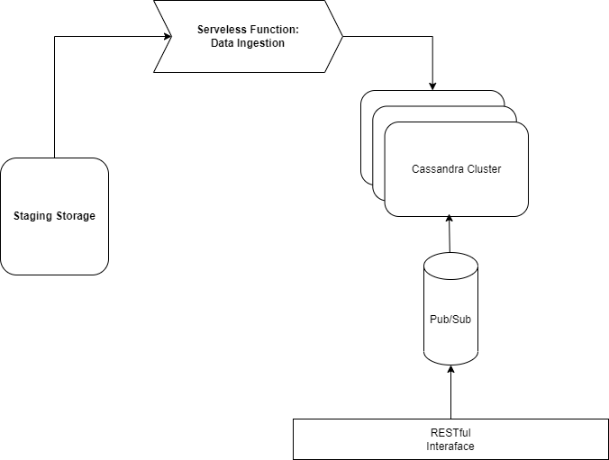

# Assignment 1 -- Report

## Part 1 - Design (weighted factor for grades = 2)
Address the following points:

1. Explain your choice of the application domain and corresponding types of data to be supported and technologies for mysimbdp-coredms. Explain under which situations/assumptions, your platform serves for big data workload (1 point)
    
    - <b> Selected Dataset </b>: [NYC Taxi Dataset](https://www1.nyc.gov/site/tlc/about/tlc-trip-record-data.page)
    
    - <b> Story </b>: I am designing a platform the could be used by to track information taxi trips made in the lively city of NY. The platfrom is supposed to support high level of availability and it should be able to handle loads of write requests that are un-evenly distributed through the day. The data collected will be used by a group of city planners and researchers who are interested in knowing the different factors influncing trip duration and the time-and-distance fare charged. Additionally, this platfrom is expected to be scaled to handle trips records of near-by cities as well. So, the system shall be designed with scalabilty in mind.

    - <b> Data Sources </b>: there is mainly two sources of data:
        1. Pre-recorded Trip Records that could be are uploaded to the governmental portal.
        2. New data points that are recorded automatically by the "smart-meter" inside the car or manually by the driver.
    
    > Thus, we are supposed to design different ways to insert data inside our platfrom:
        1. Though RESTful API to enable different vendors to easily integerate with out system.
        2. Though bulk records update. 

    - Data points, for the most part, have a structured format. But for extensability reasons, the platfrom is supposed to be flexible in handling different schemes.
    
    > Thus, we are are supposed to enable the developers to customize the structure of the database depending on each source.   

2. Design and explain the interactions among main platform components in your architecture of mysimbdp. Explain which would be the third parties (services/infrastructures) that you do not develop for your platform. (1 point)

<figure>
    
    <figcaption> Figure [1]:  System architecture</figcaption>
</figure>

- <b> Design Brief </b>:
    - Main Components: 
        - Cassandra Cluster: given the requirments specified in the story in part 1.1, I decided to use column-orianted database. the main justificaion is 1) extensibility by design. 2) high-speed write. 3) customizabiltiy with regard to the level of consistancy required by different vendors. More details will be provided in the subsequent sections.
        - Staging Storage: as mentioned in the stroy (part 1.1), users need to be able to upload bulks of data. the first option would be enabling the users to do the ingestion through their plaforms. however, this increases the probability of faliure becasue of the lack of guranttees on users hardware and connectivity. Thus, I decided to relay on a staging storgage (google cloud storage). Once a user uploads their files to the staging platform, it triggeres a serveless function (google cloud function) that perform the ingestion if that files follows the pre-defined format.  
        - Data Ingestion: continuing on the last point, data ingestion is implemented as a serveless function that is triggered once users upload a file the staging storage. There is a lot of possible scenarios. For simplicity, the current implementation will be using a pre-specified ingestion script for the NY Taxi Dataset. However, this module could be extended in the future by adding a parsing mechnism for each data file. Further, quality checks could be added as well to enforce domain-defined roles.   
        - RESTful API: our platfrom is supposed to support different vendors to directly integrate and push new trips' records into the database directly. This could be done by exposing the need functionality through RESTful API. 
        - Pub/Sub Queue: after we recieve trips' records through our RESTful API, data is pushed into the Queue. that would be consumer by a background worker which will be tranforming and pushing the data into our cassandra cluster. This component was introuduced to reduce the probability of dropping records. Further, this module could give the platform the extensiblity to handle data from different sources and from different formats.  
- <b> Technology Choice </b>: 
        - Database: Cassandra DB was selected for this project. This decision was made for a number of reasons. 1) that data we are dealing with is structured. however, based on the requirments it is possible the different vendors and/or different states collects different data. Thus, cassandra would be a great option to handle the varity of the data sources. 2) Cassadra, compared to other types of DB, is desgined from the ground-up to work in a distributed environment. and it easily operate on-top of commodity hardware. This will give our platfrom the flexibility to scale as needed. 
        - Data Ingestion: Google Cloud functions (serverless functions) were selected to perform the ingestion of the data into out platfrom. Basically, this decision was made to give our platfrom the flexible memory and resources needed ingest the data. Further, Cloud functions are extensible in the sense that it supports a wide array of triggers. In the initial design, ingestion will be performed based on cloud-storage trigger. But later, if we deciced to modify ( or optimize ) the ingestion technique, serverless functions gives us the flexability to do so.
        - Staging Storage: For sake of consistancy, Google Cloud services were selected. It provides also the advantage of being easily integerated with google cloud functions.
        - RESTful API: to implement the RESTful API, I decided to go with python-flask. this framwork was selected because of it's 'light-weight' footprint. Further, is easily integerates with other modules without being havely opinionated.   
        - Pub/Sub Queue: For the pub/sub component, i decided to go with rabbitMQT because it was light-weight and fast. Also, it enables different distributions options that would be useful when we scale our platfrom to have a dedicated DB per tenet. That is, the initial queue could be used for routing data points to the approperiate queue that would have it's dedicated consumer that feeds the data into the tenet DB.  

- <b> Third Party Services </b>: 
        - As specified in eariler (sub-)sections, Google cloud storage will be used to trigger the ingestion proccess. to upload files to our storage, our customers will be provided a script that utilizes the resumable upload functionality provided by google cloud storage. this functionality enable users to upload files in chuncks. and even in cases of upload faliures, it enable users to resume where they stopped without having to re-upload the same part more than once.    

3. Explain a configuration of a cluster of nodes for mysimbdp-coredms so that you prevent a single-point-of-failure problem for mysimbdp-coredms for your tenants (1 point)
    - To handle the initial load, Three servers distributed over three different data centers were used.  Why three? To reduce the probability of having all three down at the same time. The machines are in different data centers to reduce the probablilty that all three data centers will fail at the same time. By default, Cassandra is considered and AP system ( refering to the CAP theory ). For our use case, updates are very infrequent and writes happen in very high speed. Thus, we are selecting a write consistancy level of 1 and a read consistancy level of 2. Having a consistnacy level of 1 for writing guranttees higher level of availability of our system since a write will succeed if any of the machines inside the cluster is avaialble. 

4. You decide a pre-defined level of data replication for your tenants/customers. Explain the level of replication in your design, how many nodes are needed in the deployment of mysimbdp-coredms for your choice so that this component can work property (e.g., the system still supports redundancy in the case of a failure of a node) (1 point)
    - As mentioned in Part 1.3, the initial design utilizes three machines in three different data centers. I decided to go with a replication level of 3. that is, each row of data will exist at, at least, three different ( virtual ) nodes. this way, it is easier to discard stale data points. 


5. Explain how would you scale mysimbdp to allow many tenants using mysimbdp-dataingest to push data into mysimbdp (1 point)
    - Cassandra, out-of-the-box, supports horizontal scalling. that is, it lineary scales by adding more machines to the cluster. as specified [here](https://www.datastax.com/blog/why-does-scalability-matter-and-how-does-cassandra-scale), if cluster of a single machine handles 100 request/sec, then adding another machine of a simialr specs will enable the cluster to handle 200 request/sec. However, it should be noted that communication comes with it's own costs as well.

## Part 2 - Implementation (weighted factor for grades = 2)
Address the following points:

1.  Design, implement and explain one example of the data schema/structure for a tenant whose data will be stored into mysimbdp-coredms (1 point)

| ColumnName   |     Data Type      |  Descrition |
|----------|:-------------:|------:|
| uuid |  uuid | UUID |
| VendorID |  int | A code indicating the TPEP provider that provided the record. |
| tpep_pickup_datetime |  timestamp | The date and time when the meter was engaged. |
| tpep_dropoff_datetime |  timestamp | The date and time when the meter was disengaged. |
| passenger_count |  float | The number of passengers in the vehicle. |
| trip_distance |  float | The elapsed trip distance in miles reported by the taximeter |
| RatecodeID |  float | The final rate code in effect at the end of the trip. |
| store_and_fwd_flag |  text | This flag indicates whether the trip record was held in vehicle memory before sending to the vendor. |
| PULocationID |  int | TLC Taxi Zone in which the taximeter was engaged |
| DOLocationID |  int | TLC Taxi Zone in which the taximeter was disengaged |
| payment_type |  int | A numeric code signifying how the passenger paid for the trip. 1= Credit card 2= Cash 3= No charge 4= Dispute 5= Unknown 6= Voided trip |
| fare_amount |  float | The time-and-distance fare calculated by the meter. |
| extra |  float | Miscellaneous extras and surcharges. Currently, this only includes the $0.50 and $1 rush hour and overnight charges. |
| mta_tax |  float | $0.50 MTA tax that is automatically triggered based on the metered rate in use. |
| tip_amount |  float | Tip amount – This field is automatically populated for credit card tips. Cash tips are not included. |
| tolls_amount |  float |Total amount of all tolls paid in trip. |
| improvement_surcharge |  float | $0.30 improvement surcharge assessed trips at the flag drop. The improvement surcharge began being levied in 2015. |
| total_amount |  float | The total amount charged to passengers. Does not include cash tips. |
| congestion_surcharge |  float | Total amount collected in trip for NYS congestion surcharge. |
| airport_fee |  float | $1.25 for pick up only at LaGuardia and John F. Kennedy Airports |
    

2.  Given the data schema/structure of the tenant (Part 2, Point 1), design a strategy for data partitioning/sharding, explain the goal of the strategy (performance, data regulation and/or what), and explain your implementation for data partitioning/sharding together with your design for replication in Part 1, Point 4, in mysimbdp-coredms (1 point)

    - In cassandra, data modeling is query-driven. That is, usually we are creating one table per one query. while selecting a primary key, the first key is used for selecting the partion. and if we have a composite key, then the rest of the field are used as clustering columns. for paritioning the data, I selected to do the partitioning based on the Pickup location id. the details of the areas corresponding to each Id could be found in `data\taxi-zone-lookup.csv` and to add uniqueness to each row, i aslo added a applicaton-level generated uuid. the rationale behind this choice was my interest in selecting a partitioning key that could group a enough data points. consequently, while querying, we will be able to access only one partition. 
    

3. Assume that you are the tenant, write a mysimbdp-dataingest that takes data from your selected sources and stores the data into mysimbdp-coredms. Explain what would be the atomic data element/unit to be stored. Explain possible consistency options for writing data in your mysimdbpdataingest (1 point)

    - the atomic data point would be a row. and i decided to go with a write consistancy level of 1. the rational behind this decisions is to speed up the writing process and to make the date replication more asynchronous.


4. Given your deployment environment, measure and show the performance (e.g., response time, throughputs, and failure) of the tests for 1,5, 10, .., n of concurrent mysimbdp-dataingest writing data into mysimbdp-coredms with different speeds/velocities together with the change of the number of nodes of mysimbdp-coredms. Indicate any performance differences due to the choice of consistency options (1 point)

    - Test Enviroment:
        - CPU: 2 virtual cpus
        - Hard disk: 10 GB
        - RAM: 2 GB
        - Read/Write count:  10,000

    - READING Stats
    
        | Threads   |     Latency mean      |  Latency max | Number of Error | 
        |----------|:-------------:|------:|------:|
        | 1 |  3.9 ms | 615.0 ms |0 |
        | 10 |  13.0 ms | 319.0 ms |0 |
        | 50 |  40.6 ms | 299.4 ms |0 |
        | 100 |  69.2 ms | 529.0 ms |0 |
        | 1000 |  432.9 ms | 1647.3 ms |0 |

    - Writing  Stats
    
        | Threads   |     Latency mean      |  Latency max | Number of Error | 
        |----------|:-------------:|------:|------:|
        | 1 |  3.7 ms | 980.4 ms |0 |
        | 10 |  12.4 ms | 130.5 ms |0 |
        | 50 |  40.4 ms | 225.6 ms |0 |
        | 100 |  60.8 ms | 339.7 ms |0 |
        | 1000 | 588.0 ms | 2738.9 ms | 0  |

5. Observing the performance and failure problems when you push a lot of data into mysimbdpcoredms (you do not need to worry about duplicated data in mysimbdp), propose the change of your deployment to avoid such problems (or explain why you do not have any problem with your deployment) (1 point)

    - the system managed to handle the stress tests pretty well. however, after experimenting with `cassandra-stress` tool for a bit, I ended up reaching the disk limit. Consequently, the nodes failed to start. To avoid such a problem in the future, one should allocate enough space to each cluster according to [Datastax guide](https://docs.datastax.com/en/cassandra-oss/2.2/cassandra/planning/planPlanningHardware.html#:~:text=Most%20workloads%20work%20best%20with,500%20to%20800GB%20per%20node.)  


## Part 3 Extension (weighted factor for grades = 1)
Address the following points:

1. Using your mysimdbp-coredms, a single tenant can create many different databases/datasets. Assume that you want to support the tenant to manage metadata about the databases/datasets, what types of metadata you would like to support? Can you provide one example of using the metadata to find a dataset? (1 point)
    - In cassandra's philosphy, storage is the cheapest thing. So, it is recommended to have a table per queury. and it is recommended to only query the primary key of a table. so, it will be useful for our tenets to know what tables are stored in which database, the corresponding Primary Key, and the replications stratagy for that table.

2. Assume that each of your tenants/users will need a dedicated mysimbdp-coredms. Design the data schema of service information for mysimbdp-coredms that can be published into an existing registry (like ZooKeeper, consul or etcd) so that you can find information about which mysimbdp-coredms is for which tenants/users (1 point)
    - To extend our platform to enable different tenets of using dedicated coredms, `etcd` will be used for service discovery. The main reason behind this choice is that it will easily integerate into the existing implementation since we can easily communicate with the etcd cluster over HTTP(s). The proccess would be as follows. Whenever a user signs-up to our platfrom, a background worker will provision the needed infrastrucutre. then the details of the newly created database and it's access tokens will be pushed to `etcd`. `etcd`, at it's core, is a distributed key-value storage. Aside from it's internals, it will be mainly used during our system to link users-accounts with their projects, and to link those projects to their dedicated infrastrucure.   

    - In `etcd`, we will be access the keys through the following structure:
        ```
        .
        └── /
            └── UserID/
                └── Project/
                    └── ClusterURI

        ```

3. Explain how you would change the implementation of mysimbdp-dataingest (in Part 2) to integrate a service discovery feature (no implementation is required) (1 point)

    <figure>
        
        <figcaption> Figure [2]:  mysimbdp-dataingest integrated with service discovery</figcaption>
    </figure>

    - To integerate the service discovery module with our ingestions service, after the user authinticate into our service and send their data, our IngestionService will communicate with the ServiceDescovery Module to fetch the URi of the associate DB. then it will ingest the data accordingly.


4. Assume that now only mysimbdp-daas can read and write data into mysimbdp-coredms, how would you change your mysimbdp-dataingest (in Part 2) to work with mysimbdp-daas? (1 point)

    - In case we can only commincate with `mysimbdp-coredms` thought the `mysimbdp-daas`, the ingestion service will ingest the data-files through sending POST requests to the `mysimbdp-daas`. The straight forward change that will happen to the code will be 1) with regard to the ingestion service, I will be seralizing the data into a json format so it would be parsable between services. 2) with regard to the `mysimbdp-daas`, I will create end points that would support bulk insertion to optimize the proccess a bit. 

5. Assume that you have both mysimbdp-daas and mysimbdp-dataingest available for tenants/users to write the data into mysimbdp-coredms. Explain and provide pros and cons of deployment examples suggesting when a tenant/user should use mysimbdp-daas and mysimbdp-dataingest. (1 point)
    
    - based on the architacture of this particular platform, It would be recommended to use the ingestion service while uploading bulks of data: already pre-recorded data. this will be a lot faster and reliable for users. This is the case in our platfrom since Data ingestion is triggered once users upload their files to the clould staging platform. Otherwise, it is recommended for them to use the RESTful interface if they want to push "hot" (new) data into the platfrom. This is the case because it will be easier and faster for them to integerate the RESTful API into their (read, vendors') application stack.

